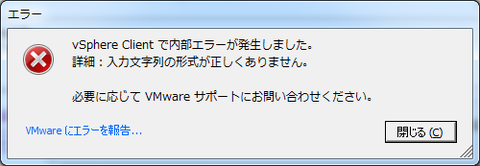

VMware, Hyper-V, kvm(+VirtualBox)のトリプルブート環境構築時のメモ。
HDD構成は以下を想定、HDDは2TBを使用。
* HDD1: VMware ESXi 5.1 (2TB)
* HDD2:
  * Hyper-V Server (1TB)
  * kvm(+Virtual Box) (1TB)

ブートローダは
* USBメモリ-VMware
* HDD2-grub(Hyper-V/Linux)

通常はUSBメモリよりVMwareをブート。Hyper-V or Linuxブートの際にはUSBメモリを抜き、画面よりどちらかを選択する。

1. VMware ESXi 5.1.0をUSBメモリにインストール
1. datastoreにHDD1を追加。当初以下のエラーが表示されていた  
     
   これは日本語化によるバグらしく、起動時に「-locale en_US」とつけることで回避可能。  
   
1. Hyper-V Server 2012のインストール  
   ディスクの指定でHDD1の半分程度を指定する。この時点で、
   * デフォルトでHyper-Vが起動
   * BIOSにてHDD2を指定するとVMwareが起動  
   という状態。ただ、Hyper-VにWindows7で管理するための設定が難しく、ブートはするが使用できない状態…
1. CentOS 6.3のインストール  
   HDD1の後半の空き領域をインストール先に指定し、デフォルトのブートデバイスとしてHDD2を指定。インストールオプションは「Virtual Host」を指定。  
   CUIで起動する。VirtualBoxはGUIがないと操作できないので以下のインストールを実施。
   ```
   yum groupinstall "X Window System"
   yum groupinstall "Desktop"
   yum groupinstall "General Purpose Desktop"
   ```
   grubではvmwareに対してはディスクを「(hd1)」と指定する。
1. Virtual Box  
   kernel-devel, gccをインストール後、ホームページよりCentOS6用のrppmをダウンロードしてインストール